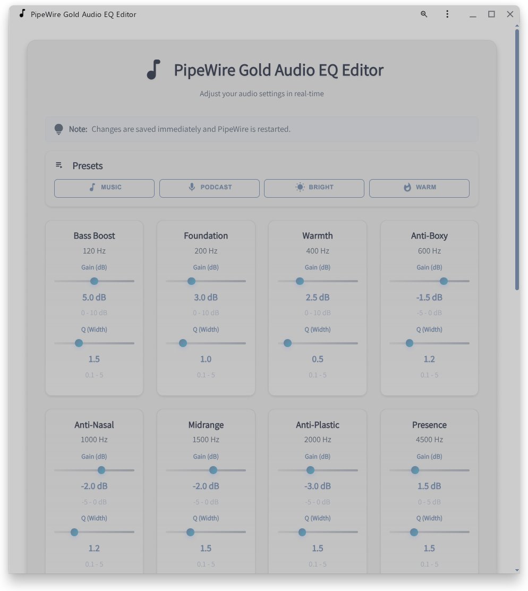
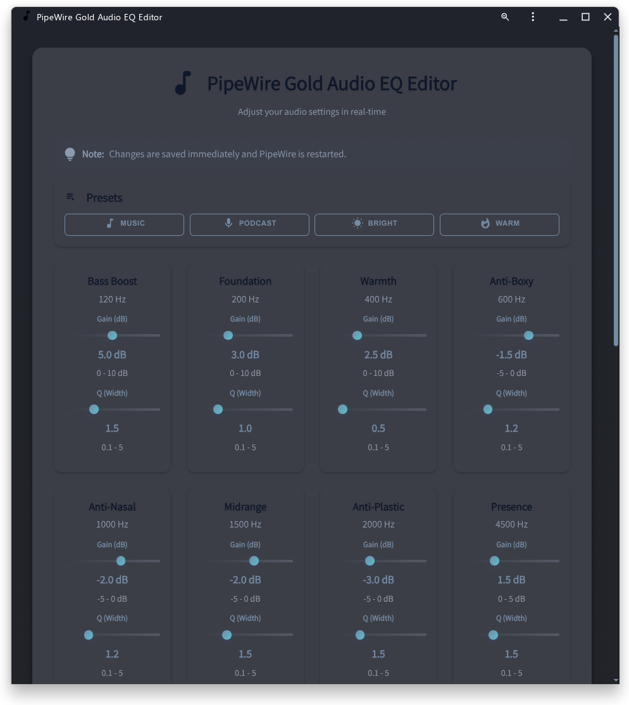

# PipeWire Audio Configuration

This project provides automated installation and configuration of multiple audio profiles including spatial audio (HeSuVi 5.1) for PipeWire.

## 💡 Purpose

This project is designed as a **resource-efficient audio enhancement solution for laptops**. Instead of expensive external audio hardware, it uses CPU-optimized PipeWire filter chains to significantly improve audio quality while keeping system resource usage minimal. Perfect for:

- **Limited hardware**: Works on budget/ultrabook laptops with modest built-in speakers
- **Low CPU overhead**: Highly optimized filters with minimal performance impact (~1-2% CPU)
- **Maximum compatibility**: Works with any PipeWire-capable Linux distribution
- **Desktop environment independent**: Works seamlessly on GNOME, KDE, XFCE, i3, Wayland, X11, and other Linux desktop environments
- **Spatial audio**: HeSuVi 5.1 convolution support for immersive listening experiences

## ⚠️ Device-Specific Presets

These audio profiles are **made for the ASUS Vivobook Go E1504FA** with its built-in speakers.

**The presets feature:**
- Bass cut-off at 65 Hz (suitable for small notebook speakers)
- EQ tuned to compensate for laptop speaker limitations
- Soft-limiter to prevent distortion on small drivers

## Overview

This project provides automated installation and configuration of PipeWire with multiple audio profiles.

### Available Profiles

1. **HeSuVi 5.1** (`sink-eq10-5.1.conf`)
   - 5.1 Surround-Sound processing (FL, FR, FC, LFE, SL, SR)
   - HeSuVi HRTF filter for spatial audio
   - Conversion to stereo output
   - 10-band EQ per channel (separate L/R processing)

2. **Standard EQ** (`sink-eq10-wide.conf`)
   - 10-Band Graphic Equalizer
   - Stereo processing (FL, FR)
   - Optimized for standard stereo playback
   - Stereo widening (Widen effect)
   - Soft-Limiter protection against clipping

### Common Features

- **Real-Time (RT) Priority** for low audio latency
- **Automatic Soundcard Detection** and audio sink configuration
- **User-Level Installation** in `~/.config/pipewire/`
- **De-Esser** to reduce sibilance (S/Sh sounds)
- **Soft-Limiter** to prevent digital clipping
- **Dynamic Config Detection** - Automatically detects active PipeWire config
- **Multi-Channel Support** - Full support for Mono/Stereo/5.1 configurations
- **Dark/Light Theme** - Automatically follows system preferences
- **Auto-Reload on Config Switch** - GUI automatically reloads when default sink changes
- **Multi-Language Support** - English & German with automatic browser detection
- **PWA Ready** - Offline-capable web application

## Requirements

- PipeWire installed and active
- `wpctl` (Part of PipeWire)
- `playerctl` (for audio playback control during restart)
- `sudo` or `doas` for group management
- Python 3.8+ (for GUI)
- Flask (for GUI)

### Optional (for RT Priority)
- Configuration in `/etc/security/limits.d/25-pw-rlimits.conf`
- Membership in the `pipewire` group

### Optional (for Production Deployment)
- Gunicorn (for production-grade server)

### Python Dependencies

Python dependencies are **automatically installed** during `./install user` into a virtual environment at `~/.local/share/goldaudio/venv/`.

**Current dependencies:**

```
Flask==3.0.0
Werkzeug==3.0.1
gunicorn==21.2.0
Flask-Babel==4.0.0
Babel==2.14.0
Jinja2==3.1.2
pytz==2024.1
```

**Manual installation (optional, only if you want to install outside the automated setup):**

```bash
# From requirements.txt
pip install -r requirements.txt

# Or individually
pip install Flask gunicorn Flask-Babel
```

## Installation

### User-Level Installation (supported method)

```bash
chmod +x ./install
./install user
```

The script will:
- Create directories in `~/.config/pipewire/`
- Detect your current username
- Detect the soundcard and its sink ID automatically
- Adjust file paths (HeSuVi, EQ filters)
- **Automatically create and configure Python virtual environment** in `~/.local/share/goldaudio/venv/`
- **Install Python dependencies** from requirements.txt into the venv
- Install and configure GUI files to `~/.local/share/goldaudio/`
- Install translation files (English, German, Turkish)
- Copy systemd service files to `~/.config/systemd/user/`
- Enable and start systemd services for automatic backend startup
- Add you to the `pipewire` group (for RT priority)
- Create automatic backups if configurations already exist

#### Installation Flow

```
Check pipewire.conf exists?
├─ YES → Ask if override
│  ├─ YES → Install new pipewire.conf
│  └─ NO  → Keep existing
└─ NO  → Install pipewire.conf

Install filter configurations (always)
Install HeSuVi files (always)
Detect audio sink (wpctl)
Set target.object in configs
Create Python venv (if not exists)
├─ Create venv in ~/.local/share/goldaudio/venv/
└─ Install requirements from requirements.txt
Install GUI files
├─ Copy gui.py, config.json, gunicorn_config.py
├─ Copy templates/ and static/ files
└─ Copy translations/
Install systemd services (always)
├─ Copy to ~/.config/systemd/user/
├─ Enable pipewire-eq.service
├─ Enable pipewire-listen.service
└─ Start pipewire-listen.service
Add user to pipewire group
```

### Uninstallation

```bash
./install uninstall
```

The script will:
- Remove HeSuVi files
- Remove filter configurations (sink-eq10-5.1.conf, sink-eq10-wide.conf)
- **Ask if pipewire.conf should be removed**
  - YES → Delete pipewire.conf
  - NO → Keep pipewire.conf (preserves manual edits)
- Disable and remove systemd service files
- Remove user from `pipewire` group

## Directory Structure

```
.
├── install                          # Installation script
├── gui.py                           # Web GUI server with dynamic config detection
├── gunicorn_config.py               # Gunicorn configuration
├── config.json                      # GUI configuration
├── babel_config.py                  # Multi-language configuration
├── requirements.txt                 # Python dependencies
├── README.md                        # This file
├── LICENSE                          # MIT License
├── pipewire.conf.d/
│   ├── pipewire.conf               # Main PipeWire configuration
│   ├── sink-eq10-5.1.conf          # HeSuVi 5.1 filter configuration (separate L/R)
│   └── sink-eq10-wide.conf         # Standard EQ stereo configuration
├── hesuvi/
│   └── hesuvi.wav                  # HeSuVi HRTF Impulse Response
├── systemd-services/
│   ├── pipewire-eq.service         # Systemd service for Gunicorn backend
│   └── pipewire-listen.service     # Systemd service for auto-starting EQ on PipeWire activity
├── static/
│   ├── css/
│   │   ├── main.css                # Main stylesheet (Light/Dark theme)
│   │   ├── main.min.css            # Minified stylesheet
│   │   ├── round.css               # Material Design icons
│   │   └── round.min.css           # Minified Material Design icons
│   ├── fonts/                       # Font files for Material Design icons
│   ├── img/                         # Images and icons
│   │   ├── favicon.ico             # Light theme favicon
│   │   ├── favicon-light.ico       # Dark theme favicon
│   │   ├── music_note.svg          # SVG music note icon
│   │   ├── music_note.ico          # Music note favicon
│   │   └── screenshot.png          # Application screenshot
│   ├── js/
│   │   ├── main.js                 # EQ editor logic with auto-config detection
│   │   ├── main.min.js             # Minified main script
│   │   ├── change-language.js      # Language auto-detection
│   │   ├── change-language.min.js  # Minified language switcher
│   │   ├── serviceworker.js        # PWA service worker
│   │   ├── serviceworker.min.js    # Minified service worker
│   │   ├── theme-toggler.js        # Light/Dark theme switcher
│   │   └── theme-toggler.min.js    # Minified theme toggler
│   └── manifest.json               # PWA manifest
└── templates/
    ├── eq.html                     # Web GUI interface
    └── eq.min.html                 # Minified Web GUI interface
```

## Configurations

### HeSuVi 5.1 (`sink-eq10-5.1.conf`)

Specialized configuration for spatial audio:

- **Input**: 5.1 Surround-Sound (FL, FR, FC, LFE, SL, SR)
- **Processing**: HeSuVi HRTF filter with 10-band EQ per channel
- **Output**: Stereo (FL, FR) with spatial impression
- **Channels**: Separate L/R processing (synchronized updates via GUI)
- **Use Case**: Movies, TV series, immersive games

### Standard EQ (`sink-eq10-wide.conf`)

Graphic 10-band equalizer for everyday music:

**EQ Bands:**
1. High-Pass (65 Hz) - removes inaudible sub-bass
2. Bass Boost (120 Hz, +6dB) - kick punch
3. Foundation (200 Hz, +5dB) - bass body
4. Warmth (400 Hz, +3dB) - warmth and proximity
5. Anti-Boxy (600 Hz, -1.5dB) - reduces papery sound
6. Anti-Nasal (1000 Hz, -2dB) - reduces nasal tone
7. Midrange Clarity (1500 Hz, -2dB) - clarity and separation
8. Anti-Plastic (2000 Hz, -3dB) - natural, organic sound
9. Presence (4500 Hz, +1.5dB) - speech intelligibility
10. Brilliance (9000 Hz, +2dB) - detail and sparkle
11. Air (12000 Hz, +2dB) - silkiness and extension

**Additional Features:**

- **De-Esser** (6 kHz, -1.5dB) - reduces sibilance from S/Sh sounds
- **Soft-Limiter** (High-Shelf, 10 kHz, -1dB) - prevents digital clipping
- **Stereo widening** (0.35) - wider stereo impression
- **Final gain** (1.15 = +1dB) - transparent level boost
- **CPU Impact**: Low (11 EQ bands only)

**Signal Flow:**
```
Input → High-Pass → EQ Bands (1-11) → De-Esser → Final Gain → Soft-Limiter → Output
```

#### Gain Calculation

```
Factor = 10^(dB / 20)
+1dB  ≈ 1.12
+2dB  ≈ 1.26
+3dB  ≈ 1.41
+4dB  ≈ 1.58
+6dB  ≈ 2.00
```

## Web GUI

The project includes an interactive web-based EQ editor for real-time audio adjustments.

### Screenshots

<div style="display: flex; gap: 20px; justify-content: center;">
  <div style="flex: 1; max-width: 45%;">
    <h4>Light Theme</h4>
    
  </div>
  <div style="flex: 1; max-width: 45%;">
    <h4>Dark Theme</h4>
    
  </div>
</div>

### Features

- **Real-time EQ adjustments** with instant preview
- **Dual sliders per band**: Gain (dB) and Q (bandwidth) control
- **Automatic Config Detection**: Detects active PipeWire config via `node.description`
- **Auto-Reload on Config Switch**: GUI automatically reloads when you change the default sink (via `wpctl set-default`)
- **Multi-Channel Support**: Full support for 5.1 L/R channel synchronization
- **Audio presets**: Music, Podcast, Bright, Warm, Reset
- **Visual feedback**: Live value displays and status messages
- **Automatic backups**: All changes are backed up to `~/.local/share/goldaudio/backups/`
- **Dark/Light Theme**: Automatically follows system preferences (respects `prefers-color-scheme`)
- **Multi-Language UI**: English, Deutsch & Türkçe with automatic browser detection
- **PWA Support**: Can be installed as standalone app
- **Modern UI**: Responsive design with Material Design icons

### Language Support

The GUI supports multiple languages with automatic detection:

**Supported Languages:**
- 🇬🇧 English
- 🇩🇪 Deutsch (German)
- 🇹🇷 Türkçe (Turkish)

**How language selection works:**

1. **Auto-Detection** (first visit):
   - Browser language is detected (e.g., `de-DE` → `de`)
   - Page is automatically rendered in detected language
   - Selection is saved to browser localStorage

2. **URL Parameter**:
   - Access specific language: `http://127.0.0.1:1338/?lang=de`
   - Overrides browser language and saves to localStorage

**Example:**
```bash
# German user opens GUI → automatically in German
# User can access English via: http://127.0.0.1:1338/?lang=en
# User can access Turkish via: http://127.0.0.1:1338/?lang=tr
# Page reloads and stays in selected language (localStorage)
```

### Theme Support

The GUI automatically adapts to your system's color scheme preference:

- **Light Theme**: Clean, bright interface optimized for daytime use
- **Dark Theme**: Dark interface optimized for low-light environments

Supported in:
- Linux (GNOME, KDE, X11, Wayland)
- Firefox, Chrome, Safari
- Respects system `prefers-color-scheme` setting

**To change theme:**
1. **System Setting**: Change your OS theme (Settings → Appearance)
2. **Browser Override**: Browser dev tools → Console:
   ```javascript
   // Force dark theme
   document.documentElement.style.colorScheme = 'dark';
   
   // Force light theme
   document.documentElement.style.colorScheme = 'light';
   ```

### Automatic Config Detection

The GUI automatically detects which PipeWire configuration is currently active:

```python
# Mapping of PipeWire configs
CONFIG_MAPPING = {
    "Pipewire Gold Standard Audio": "sink-eq10-wide.conf",
    "Pipewire Gold (5.1) Audio": "sink-eq10-5.1.conf"
}
```

**How it works:**
1. GUI queries active sink via `wpctl status`
2. Reads `node.description` from sink
3. Matches against CONFIG_MAPPING
4. Loads corresponding config file
5. Falls back to `sink-eq10-wide.conf` if detection fails

**Manual config switching:**
```bash
# List available sinks
wpctl status

# Set sink as default (GUI will automatically reload)
wpctl set-default <sink-id>

# GUI automatically detects new config and reloads
```

### Auto-Reload on Config Switch

When you change the default sink using `wpctl set-default`:

1. **Frontend polls** `/api/config-info` every 2 seconds
2. **Server detects** config change (with 1-second caching)
3. **GUI auto-reloads** automatically (`location.reload()`)
4. **New values** are loaded and displayed

**Example workflow:**
```bash
# Terminal 1: Start GUI
python3 gui.py

# Terminal 2: Switch to different sink
wpctl status                          # List sinks
wpctl set-default <sink-id>          # Change default

# GUI automatically reloads and shows new config values!
```

### Multi-Channel Support (5.1)

For 5.1 configurations with separate L/R channels:

- **Automatic Detection**: GUI detects `_L` and `_R` suffixes
- **Synchronized Updates**: Both channels updated with same values
- **Single GUI Interface**: Same sliders control both channels
- **Backup Strategy**: One backup per update (covers both channels)

**Example 5.1 band structure:**
```
eq_band_1_L  ← Left channel
eq_band_1_R  ← Right channel (automatically updated)
```

### Running the GUI

**Note:** Python dependencies are automatically installed during installation into `~/.local/share/goldaudio/venv/`. You can either activate the venv or use the venv Python directly.

#### Development Mode (Flask built-in server)

**Option 1: Using venv directly**
```bash
~/.local/share/goldaudio/venv/bin/python3 ~/.local/share/goldaudio/gui.py
```

**Option 2: Activate venv first**
```bash
source ~/.local/share/goldaudio/venv/bin/activate
python3 ~/.local/share/goldaudio/gui.py
```

**Pros:**
- Simple startup
- Auto-reload on code changes
- Great for development and testing

**Cons:**
- Single-threaded (only one connection at a time)
- Not suitable for production
- Slower performance

Then open your browser and navigate to: **http://127.0.0.1:1338**

#### Production Mode (Gunicorn WSGI server)

**Option 1: Using venv directly**
```bash
~/.local/share/goldaudio/venv/bin/python3 -B -m gunicorn --config ~/.local/share/goldaudio/gunicorn_config.py --chdir ~/.local/share/goldaudio gui:app
```

**Option 2: Activate venv first**
```bash
source ~/.local/share/goldaudio/venv/bin/activate
cd ~/.local/share/goldaudio
python3 -B -m gunicorn --config gunicorn_config.py gui:app
```

**Pros:**
- Multi-worker support (concurrent connections)
- Better performance and stability
- Production-grade reliability
- Pre-fork worker model for robustness

**Cons:**
- More resource intensive than Flask dev server

All dependencies pre-installed during `./install user`. No additional setup needed!

Then navigate to: **http://127.0.0.1:1338**

#### Automatic Startup via Systemd Services

The systemd service files are **automatically installed and enabled** during the `./install user` process. No manual setup needed!

**What gets installed automatically:**

1. **pipewire-eq.service** - Starts the Gunicorn backend
   - Virtual environment: `~/.local/share/goldaudio/venv/`
   - Multi-worker Gunicorn server (2 workers)
   - Resource limits (64M memory, 50% CPU)
   - Auto-restart on failure (5 second delay)
   - Port: 1338

2. **pipewire-listen.service** - Auto-starts EQ editor when PipeWire is active
   - Monitors PipeWire state changes
   - Automatically starts `pipewire-eq.service` when compatible audio sink detected
   - Stops service when switching to different audio device
   - Protects backups during EQ operation

**After install completes:**
- Services are copied to `~/.config/systemd/user/`
- Services are enabled for automatic startup on boot
- `pipewire-listen.service` is started immediately
- Backend starts automatically when you log in

**Manual service management:**

If you need to restart or manage the services manually:

```bash
# Check service status
systemctl --user status pipewire-eq.service
systemctl --user status pipewire-listen.service

# View logs in real-time
journalctl --user -u pipewire-eq.service -f
journalctl --user -u pipewire-listen.service -f

# Stop/restart services
systemctl --user stop pipewire-eq.service
systemctl --user restart pipewire-eq.service

# View all services
systemctl --user list-units --type=service
```

**Customization:**

Edit `~/.config/systemd/user/pipewire-eq.service` to adjust:
- Port (default: 1338)
- Worker count (default: 2)
- Memory limit (default: 64M)
- CPU quota (default: 50%)

After changes:
```bash
systemctl --user daemon-reload
systemctl --user restart pipewire-eq.service
```

**Disable automatic startup (if needed):**

```bash
systemctl --user disable pipewire-listen.service
systemctl --user disable pipewire-eq.service
```

### GUI Configuration

Edit `config.json` to customize GUI behavior:

```json
{
  "site_config": {
    "title": "PipeWire Gold Audio EQ Editor",
    "port": 1338,
    "host": "127.0.0.1"
  }
}
```

### Backup Management

All EQ changes are automatically backed up to:

```
~/.local/share/goldaudio/backups/
```

- **Backup strategy**: Circular (oldest backup is overwritten when limit reached)
- **Max backups**: 10 per configuration file
- **Naming**: `sink-eq10-wide.conf.backup_YYYYMMDD_HHMMSS`
- **Multi-channel backups**: Single backup covers all L/R channels in 5.1

### Presets

Available presets for quick EQ switching:

- **Music** - Boosted bass and presence for music listening
- **Podcast** - Optimized for speech intelligibility
- **Bright** - Bright, detailed sound for analytical listening
- **Warm** - Warm, smooth sound for casual listening
- **Reset** - Revert to default configuration

## Automatically Configured Values

The installation script automatically adjusts the following values:

```ini
target.object = "sink-name"      # Your audio sink
```

File paths are set to the user's installation directory:
```
~/.config/pipewire/hesuvi/hesuvi.wav
```

### Manual Soundcard Detection

If automatic detection doesn't work:

1. **Get sink ID:**
   ```bash
   wpctl status
   ```
   Look for "Speaker + Headphones" and note the ID (e.g. 75)

2. **Get sink name:**
   ```bash
   wpctl inspect <ID> | grep 'node.name' | awk '{print $4}' | tr -d '"'
   ```

3. **Manually edit configuration:**
   ```bash
   editor ~/.config/pipewire/pipewire.conf.d/sink-eq10-wide.conf
   ```
   
   Find and update:
   ```ini
   target.object = "alsa_output.pci-0000_03_00.6.HiFi__hw_Generic_1__sink"
   ```

## Real-Time Priority

For optimal audio latency, PipeWire should run with Real-Time (RT) priority.

### Check Prerequisites

```bash
# Check RT limits
cat /etc/security/limits.d/25-pw-rlimits.conf

# Check RT status
ps -mo pid,tid,rtprio,comm -C pipewire
```

The installation script automatically adds you to the `pipewire` group. After login, RT priority should be enabled.

**Important**: Log out and log back in for group changes to take effect!

## Usage

After installation and restart, new audio sinks will be created automatically.

### Available Sinks

- **Pipewire Gold (5.1) Audio** - HeSuVi 5.1 for spatial audio (separate L/R channels)
- **Pipewire Gold Standard Audio** - 10-Band EQ for standard stereo

### Commands

```bash
# List all available sinks
wpctl status

# Set default sink (GUI will auto-reload with new config)
wpctl set-default <sink-id>

# Inspect sink details (see active filters)
wpctl inspect <sink-id>

# Get active config's node.description
wpctl inspect <sink-id> | grep 'node.description'

# Restart PipeWire after manual config changes
systemctl --user restart pipewire

# View logs
journalctl --user -u pipewire -f
```

## Troubleshooting

### Audio Not Working

```bash
# Check available sinks
wpctl status

# Verify sink is active
wpctl inspect <sink-id>

# Set the sink as default
wpctl set-default <sink-id>

# Restart PipeWire
systemctl --user restart pipewire
```

### Filter Not Loading

```bash
# Restart PipeWire (required after config changes)
systemctl --user restart pipewire

# Check logs for errors
journalctl --user -u pipewire -f

# Verify target.object is correct
grep "target.object" ~/.config/pipewire/pipewire.conf.d/sink-eq10-wide.conf

# Check sink name manually
wpctl inspect <sink-id> | grep 'node.name'
```

### GUI Not Detecting Config

The GUI uses `node.description` to detect active config:

```bash
# Check actual node.description
wpctl status | grep '*' | awk '{print $3}' | tr -d '.' | head -n1 | xargs wpctl inspect | grep 'node.description'

# If not in CONFIG_MAPPING, add to gui.py:
CONFIG_MAPPING = {
    "Your Config Name": "your-config-file.conf"
}

# Restart GUI after changes
```

### GUI Not Auto-Reloading on Config Switch

**Check if polling is active:**
1. Open Browser DevTools (F12)
2. Check Console for `config_info` requests
3. Should see requests every 2 seconds

**If no polling:**
```bash
# Check browser console for JavaScript errors
# Make sure /api/config-info endpoint is working:
curl http://127.0.0.1:1338/api/config-info
```

**Manual reload:**
```bash
# Force page reload after changing sink
wpctl set-default <sink-id>
# Then manually refresh browser (Ctrl+R or Cmd+R)
```

### GUI Language Not Switching

**Check browser localStorage:**
```javascript
// In browser DevTools Console:
localStorage.getItem('language')

// Clear language preference
localStorage.removeItem('language')

// Hard refresh browser (Ctrl+Shift+R)
```

**Check Flask-Babel configuration:**
```bash
# Verify translations exist
ls -la translations/

# Should show: en/, de/, tr/ directories with LC_MESSAGES/messages.po
```

### 5.1 Config Band Values Not Reading

Ensure bands have correct naming with `_L` and `_R` suffixes:

```bash
# Check band names in config
grep "name = " ~/.config/pipewire/pipewire.conf.d/sink-eq10-5.1.conf | head -20

# Should show: eq_band_1_L, eq_band_1_R, etc.
```

### Audio Crackles/Pops

This indicates CPU overload. Solutions:
1. Disable HeSuVi 5.1 (high CPU cost)
2. Increase quantum size in pipewire.conf:
   ```ini
   default.clock.quantum = 2048
   ```
3. Check CPU usage:
   ```bash
   top -p $(pgrep pipewire)
   ```

### RT Priority Not Taking Effect

```bash
# Check user group membership
groups $USER

# Expected output should include: pipewire

# Check limits
ulimit -r

# Should show: unlimited

# Restart PipeWire
systemctl --user restart pipewire

# Verify RT priority
ps -mo pid,tid,rtprio,comm -C pipewire
```

### Clipping/Distortion

If audio sounds distorted or clips:
1. Reduce EQ gains (especially bands 1-3)
2. Verify soft-limiter is enabled at 10 kHz, -1dB
3. Check playback volume in system settings
4. Reduce overall gain if needed

### GUI Won't Start

**Python dependencies issue** (if installation failed):
```bash
# Reinstall dependencies into venv
source ~/.local/share/goldaudio/venv/bin/activate
pip install -r requirements.txt

# Or from the project directory
~/.local/share/goldaudio/venv/bin/pip install -r ~/path/to/requirements.txt
```

**Flask dev server issues:**
```bash
# Activate venv first
source ~/.local/share/goldaudio/venv/bin/activate

# Run with verbose output
python3 -u ~/.local/share/goldaudio/gui.py
```

**Gunicorn issues:**
```bash
# Activate venv and run from GUI directory
source ~/.local/share/goldaudio/venv/bin/activate
cd ~/.local/share/goldaudio
python3 -B -m gunicorn --config gunicorn_config.py gui:app

# If pkg_resources error occurs, try Flask dev server instead
python3 -u gui.py
```

**Check venv status:**
```bash
# Verify venv exists and is working
~/.local/share/goldaudio/venv/bin/python3 --version

# List installed packages
~/.local/share/goldaudio/venv/bin/pip list

# Should include: Flask, gunicorn, Flask-Babel
```

## Customizing EQ Settings

EQ bands can be adjusted in `sink-eq10-wide.conf` or through the web GUI:

```ini
{ type = "builtin" name = "eq_band_1" label = "bq_peaking" 
  control = { Freq = 120.0 Q = 1.5 Gain = 6.0 } }
```

- **Freq**: Center frequency in Hz
- **Q**: Quality factor (higher = narrower bandwidth, more precise)
- **Gain**: Boost/Cut in dB (positive = boost, negative = cut)

### Via Web GUI

1. Start the GUI: `python3 gui.py` or `python3 -B -m gunicorn --config gunicorn_config.py gui:app`
2. Open **http://127.0.0.1:1338** in your browser
3. GUI automatically detects active config
4. Language automatically selected (Browser → localStorage → default EN)
5. Adjust sliders for Gain and Q values
6. Click "Save changes" to apply
7. Changes are automatically backed up and PipeWire is restarted
8. GUI remains open with updated values

### Manual Editing

Edit `~/.config/pipewire/pipewire.conf.d/sink-eq10-wide.conf` directly and restart PipeWire:

```bash
systemctl --user restart pipewire
```

For 5.1 configs, remember to update both `_L` and `_R` channels:

```bash
# Edit sink-eq10-5.1.conf
editor ~/.config/pipewire/pipewire.conf.d/sink-eq10-5.1.conf

# Update both channels, then restart
systemctl --user restart pipewire
```

### Soft-Limiter Adjustment

To make limiter less aggressive:
```ini
{ type = "builtin" name = "soft_limiter" label = "bq_highshelf" 
  control = { Freq = 10000.0 Q = 0.7 Gain = -0.5 } }
```

To make limiter more aggressive:
```ini
{ type = "builtin" name = "soft_limiter" label = "bq_highshelf" 
  control = { Freq = 10000.0 Q = 0.7 Gain = -2.0 } }
```

After any changes:
```bash
systemctl --user restart pipewire
```

## Known Limitations

- **User-level installation only**: System-wide installation can cause audio playback issues when switching the default device
- **No hardware compressor**: PipeWire filter-chain does not include native compressor. Use soft-limiter or reduce EQ gains instead.
- **Single target device**: Each configuration targets one audio sink. For multiple devices, manually create separate configurations.
- **HeSuVi 5.1 CPU intensive**: Convolver + 20 EQ bands require significant CPU. Use Standard EQ for lower-end systems.
- **GUI requires restart**: EQ parameter changes via GUI trigger automatic PipeWire restart (~2 seconds of audio loss)
- **5.1 detection**: GUI requires `_L` and `_R` suffixes for 5.1 channel detection. Standard configs without suffixes work as Stereo.
- **Config polling interval**: 2-second polling may introduce slight delay in detecting config changes
- **Language files**: Translation files must exist in `translations/` directory for multi-language support

## Contributing

Contributions are welcome! Please feel free to submit improvements, bug reports, or new features.

## License

This project is licensed under the MIT License. See [LICENSE](LICENSE) for details.

---

**Last Updated:** 2026-03-17  
**Version:** 1.0.3  
**Status:** Stable ✅
